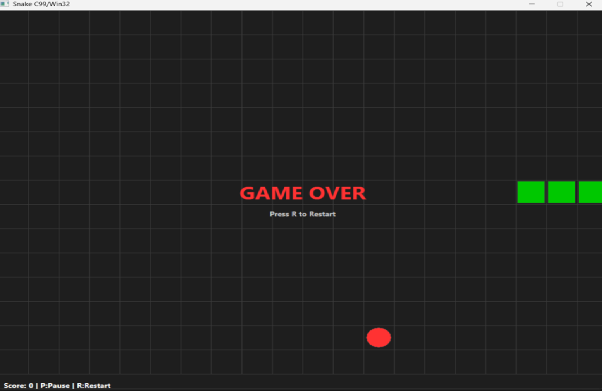
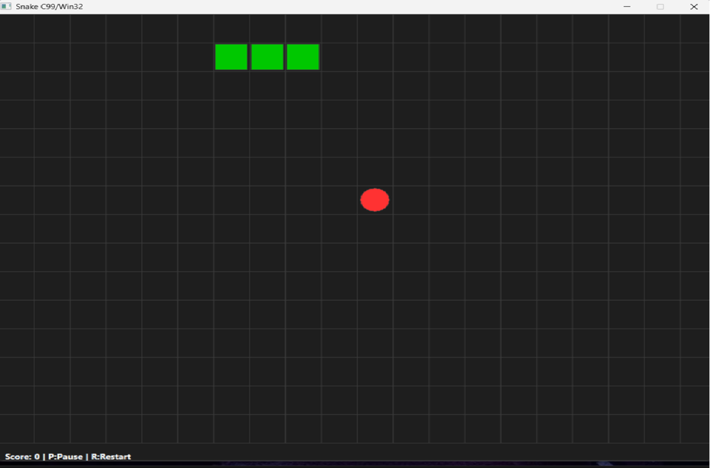
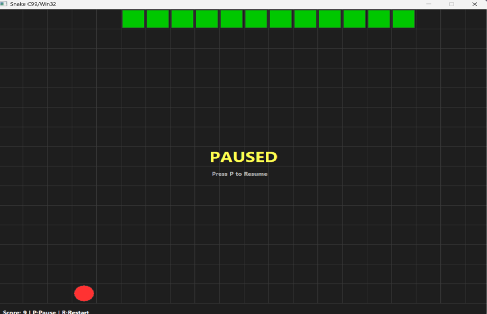
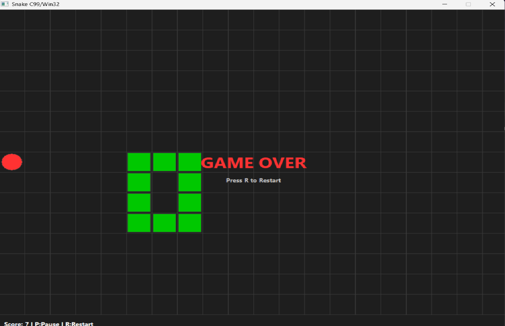

# Змейка
## Описание
Классическая игра «Змейка», реализованная на языке C с использованием WinAPI и GDI.
Особенности реализации: В качестве особенностей можно выделить строгую модульную архитектура с разделением логики и интерфейса. Также используется стабильный игровой цикл с фиксированным шагом.
## Управление
- Стрелки — Управление направлением движения.
- Клавиши P и Space — Пауза / Продолжение.
- Клавиша R — Перезапуск после проигрыша.
## Архитектура и Модули
Проект разделен на два независимых модуля. Core - Модуль логики,  Файлы:`core.h`, `core.c` В качестве задач этого модуля можно выделить: 1)Хранение состояния игры. 2)Обработка направлений и предотвращение разворота на 180°. 3)Спавн еды и подсчёт очков.
Ui - Модуль интерфейса, Файлы:`ui.h`, `ui.c , В качестве задач этого модуля можно выделить: 1)Создание окна. 2)Обработка сообщений. 3)Отрисовка через GDI с использованием двойной буферизации.
## Сборка и Запуск
Компилятор: GCC (MSYS2 / MinGW-w64), стандарт C11.
Платформа: Windows (x64).
Для сборки из командной строки (PowerShell/CMD) перейдите в папку проекта и выполните:
```powershell
gcc -std=c11 -Wall -Wextra -O2 -mwindows -lgdi32 -luser32 -o snake.exe src/main.c src/core/core.c src/ui/ui.c
##  Скриншоты: 



